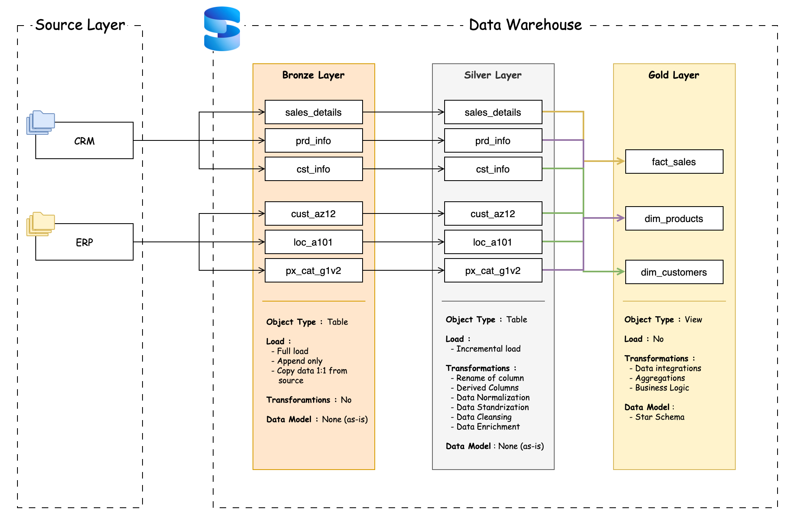
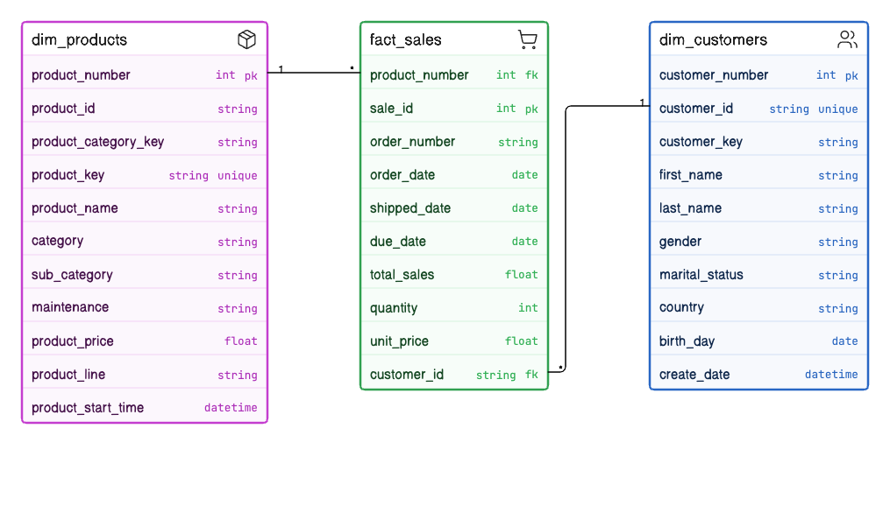

# Data-warehouse-MSSQL-project

Data Warehouse built on Medallion Architecture (Bronze/Silver/Gold) with strong Separation of Concerns (SoC) principles for each layer, serving downstream analytics & Web Application APIs.

## About the Project
This repository contains the codebase and infrastructure for a Modern Data Warehouse built using Microsoft SQL Server. The data pipeline integrates customer, product, and sales data from multiple source systems (CRM and ERP) into a centralized, analytical data model.

## Architecture Design

The project strictly follows the Medallion Data Architecture (Bronze -> Silver -> Gold), designed to incrementally process, clean, and model data for downstream analytics.



### Data Layers
1. **Bronze Layer (Raw Data)**: 
   - Landing zone for raw, append-only data ingested directly from source systems.
   - Includes metadata tracking columns (e.g., extraction timestamps).
2. **Silver Layer (Cleansed & Conformed)**:
   - Data is cleaned, deduplicated, and standardized.
   - Schema drift and data quality issues are handled here.
   - Utilizes state management and high-water marks for incremental loads.
3. **Gold Layer (Business Level & Analytics)**:
   - Heavily modeled data tailored for reporting and business intelligence.
   - Uses Kimball Dimensional Modeling (Star Schema) with Fact and Dimension views.

## Entity-Relationship Diagram (ERD)

The core business logic is modeled in the Gold layer to simplify analytical queries. The schema resolves natural keys and handles slowly changing dimensions, integrating CRM and ERP data seamlessly.



## Technology Stack
- **Database**: Microsoft SQL Server 2022
- **Infrastructure**: Docker & Docker Compose
- **Language**: T-SQL (Stored Procedures, Views, DDL)

## Repository Structure
```text
.
├── data/                       # Local volume mapping for SQL server data and source files
├── docs/                       # Documentation and diagram markdown files
├── scripts/
│   ├── infra_scrip.sql         # Initial DDL script to setup database, schemas, and watermarks
│   ├── bronze/                 # Scripts and procedures for the Bronze Layer
│   ├── silver/                 # Scripts for Incremental load & deduplication (Silver Layer)
│   └── gold/                   # Fact and Dimension views for the Gold Layer
├── docker-compose.yml          # Container configuration for local SQL Server deployment
└── README.md                   # Project documentation
```

## Getting Started

### Prerequisites
Make sure you have the following installed on your machine:
- [Docker](https://www.docker.com/) & Docker Compose
- `make` utility

### Installation & Setup

This project includes a `Makefile` to automate the setup and execution of the data pipeline.

1. **Configure Credentials**
   First, you need to set up your environment variables. Run the following command:
   ```bash
   make setup
   ```
   *This command creates a `.env` file from the `.env.example` template. You **must** open the newly created `.env` file and set all of your actual credentials (like `DB_PASSWORD`) before moving on to the next step.*

2. **Start the Database Environment**
   Spin up the SQL Server instance by running:
   ```bash
   make up
   ```
   *This command starts the container in the background and waits for SQL Server to be ready. The database will be accessible at `localhost:1433`.*

3. **Initialize the Infrastructure**
   Run the infrastructure setup script to create the `DataWareHouse` database, schemas, and necessary configuration tables (like watermarks):
   ```bash
   make init
   ```
   *Note: Running `make init` will drop and recreate the DataWareHouse database if it already exists.*

## Usage

### Run the Data Pipeline
You can execute the entire ETL pipeline from Bronze to Gold in one go:
```bash
make run-all
```

Alternatively, you can run the pipeline layer-by-layer:
```bash
make bronze   # Load raw data from CRM and ERP sources
make silver   # Clean, deduplicate, and perform incremental loads
make gold     # Create analytics-ready Fact and Dimension views
```

### Tear Down
To stop and remove the SQL Server container, run:
```bash
make down
```

### Help Command
To see a list of all available commands, simply run:
```bash
make help
```

## Contributing
Contributions are what make the open-source community such an amazing place to learn, inspire, and create. Any contributions you make are **greatly appreciated**.

1. Fork the Project
2. Create your Feature Branch (`git checkout -b feature/AmazingFeature`)
3. Commit your Changes (`git commit -m 'Add some AmazingFeature'`)
4. Push to the Branch (`git push origin feature/AmazingFeature`)
5. Open a Pull Request

## License
Distributed under the MIT License. See `LICENSE` for more information.
